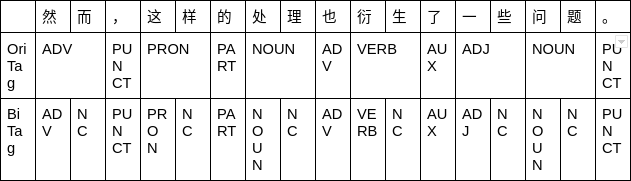
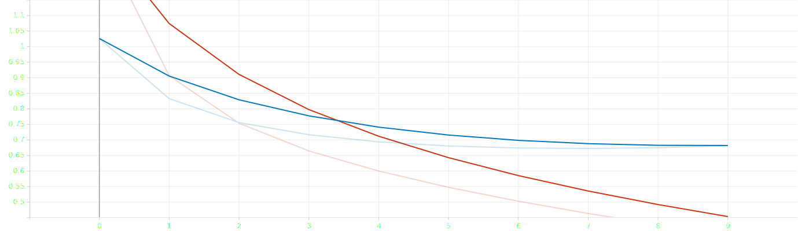
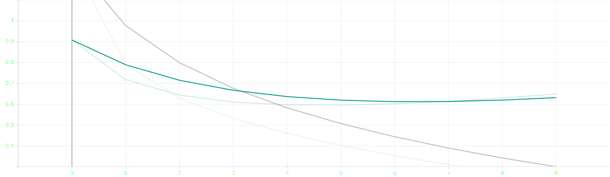
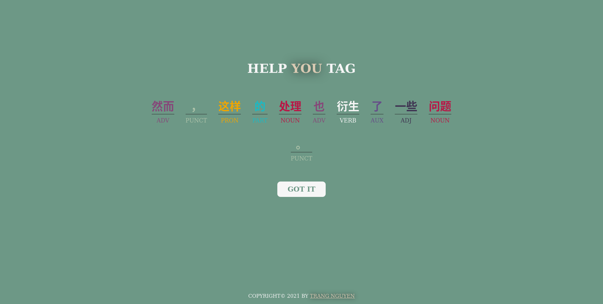

# Chinese Part-of-Speech tagging with bi-LSTM network (Pytorch)

**Repo**: [https://github.com/tracy2811/chinese-pos-tagging-bi-lstm](https://github.com/tracy2811/chinese-pos-tagging-bi-lstm)

## Report

1. [Technical Report](./report/d2.md)

1. [Presentation](./report/presentation.pdf)

## Dataset

[UD_Chinese-GSDSimp](https://github.com/UniversalDependencies/UD_Chinese-GSDSimp/tree/master) dataset from [Universal Dependencies](https://universaldependencies.org

|            | Train | Test | Total |
| ---------- | ----- | ---- | ----- |
| #Sentences | 3997  | 500  | 4997  |

| POS tag | Meaning                  | Class  |
| ------- | ------------------------ | ------ |
| ADJ     | Adjective                | Open   |
| ADV     | Adverb                   | Open   |
| NOUN    | Noun                     | Open   |
| PROPN   | Pronoun                  | Open   |
| VERB    | Verb                     | Open   |
| ADP     | Adposition               | Closed |
| AUX     | Auxiliary                | Closed |
| CCONJ   | Coordinating conjunction | Closed |
| DET     | Determiner               | Closed |
| NUM     | Numeral                  | Closed |
| PART    | Particle                 | Closed |
| PRON    | Pronoun                  | Closed |
| PUNCT   | Punctuation              | Other  |
| SYM     | Symbol                   | Other  |
| X       | Other                    | Other  |

Example data:

```
# sent_id = test-s1
# text = 然而，这样的处理也衍生了一些问题。
1	然而	然而	ADV	RB	_	7	mark	_	SpaceAfter=No
2	，	，	PUNCT	,	_	7	punct	_	SpaceAfter=No
3	这样	这样	PRON	PRD	_	5	det	_	SpaceAfter=No
4	的	的	PART	DEC	Case=Gen	3	case	_	SpaceAfter=No
5	处理	处理	NOUN	NN	_	7	nsubj	_	SpaceAfter=No
6	也	也	ADV	RB	_	7	mark	_	SpaceAfter=No
7	衍生	衍生	VERB	VV	_	0	root	_	SpaceAfter=No
8	了	了	AUX	AS	Aspect=Perf	7	aux	_	SpaceAfter=No
9	一些	一些	ADJ	JJ	_	10	amod	_	SpaceAfter=No
10	问题	问题	NOUN	NN	_	7	obj	_	SpaceAfter=No
11	。	。	PUNCT	.	_	7	punct	_	SpaceAfter=No
```

---

## Pre-processing

Mapping: token - index, POS tag - index

### For POS-tagging-only models (LSTM, and Bi-LSTM)

No extra steps before mapping, no new tag, each token may have one ore more Simplified characters.

### For Joint WS and POS tagging model (Joint Bi-LSTM)

One token is one character. New tag `NC` is introduced to indicate that this character joins with the previous character.



---

## Models

3 models:

- POS-tag-only: LSTM, Bi-LSTM
- WS and POS-tag: joint Bi-LSTM

Each has 3 layers:

1. Embedding

1. LSTM (bidirectional or not)

1. Linear

Summary for the Bi-LSTM model. The Embedding dimension `EMBEDDING_DIM` and hidden dimension `HIDDEN_DIM` are set to 64.

```
BiLSTMTagger(
  (word_embeddings): Embedding(3514, 64)
  (lstm): LSTM(64, 64, bidirectional=True)
  (hidden2tag): Linear(in_features=128, out_features=16, bias=True)
)
```

---

## Train and Test Results

- Loss: negative log likelihood loss `NLLLoss`

- Optimizer: stochastic gradient descent `SGD`

- Metric: F1 score

- Number of epochs: 10

| Model         | F1 avg | F1     |
| ------------- | ------ | ------ |
| LSTM          | 0.7933 | 0.7930 |
| Bi-LSTM       | 0.8185 | 0.8140 |
| Joint Bi-LSTM | 0.8461 | 0.8471 |

LSTM train and test loss


Bi-LSTM train and test loss


Joint Bi-LSTM train and test loss


Joint Bi-LSTM prediction example:

```
由于认为德义军队战力已就绪，隆美尔决定再发动攻势。
['ADP', 'NC', 'VERB', 'NC', 'PROPN', 'PROPN', 'NOUN', 'NC', 'NOUN', 'NC', 'ADV', 'VERB', 'NC', 'PUNCT', 'PROPN', 'NC', 'NC', 'VERB', 'NC', 'ADV', 'VERB', 'NC', 'NOUN', 'NC', 'PUNCT']
['ADP', 'NC', 'VERB', 'NC', 'PROPN', 'NC', 'NOUN', 'NC', 'NOUN', 'NC', 'ADV', 'VERB', 'NC', 'PUNCT', 'PROPN', 'NC', 'NC', 'NOUN', 'NC', 'ADV', 'VERB', 'NC', 'NOUN', 'NC', 'PUNCT']
0.916952380952381
```

---

## Web Demo

Joint Bi-LSTM + Flask

Installation:

1. Make sure Python 3 is installed. Download this repo, then go inside demo folder.

1. Install packages and start server

   ```
   pip install -r requirements.txt
   flask run
   ```

1. Go to [localhost:5000](localhost:5000)

Input screenshot


Result screenshot


---

## References

- [Kaggle note book: LSTM (character + word) POS-tag model PyTorch ](https://www.kaggle.com/krishanudb/lstm-character-word-pos-tag-model-pytorch)
- [Joint Khmer Word Segmentation and POS Tagging](https://towardsdatascience.com/joint-khmer-word-segmentation-and-pos-tagging-cad650e78d30)
