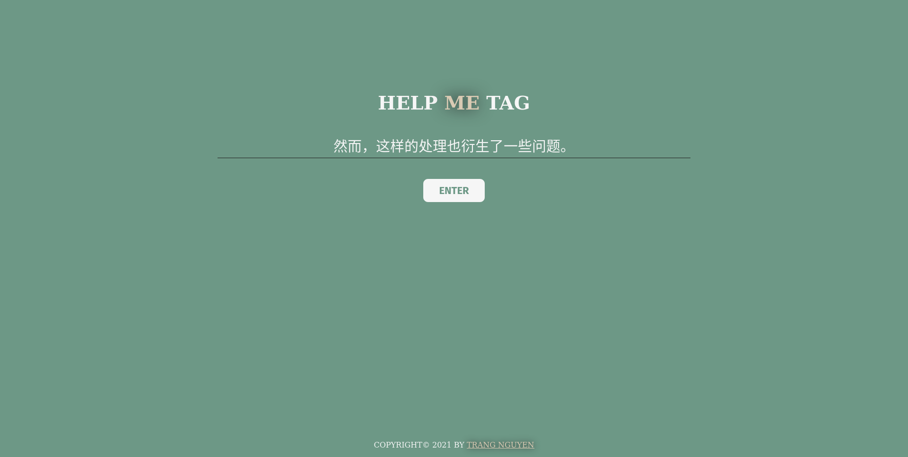

# Joint Bi-LSTM Web Demo

Joint Bi-LSTM Model + Flask

## Setup

  1. Make sure Python 3 is installed. Download this repo, then go inside demo folder.

  1. Install packages and start server

      ```
      pip install -r requirements.txt
      flask run
      ```

  1. Go to [localhost:5000](localhost:5000)

## Screenshots

Input screenshot


Result screenshot
