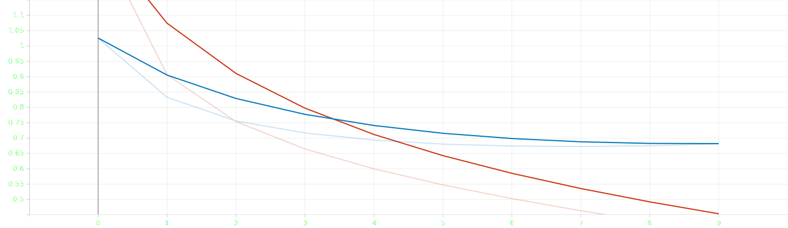
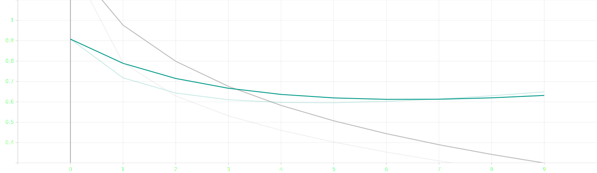

# Chinese Part-of-Speech tagging with bi-LSTM attention network

**Full name**: Trang Nguyen

**Group**: BS-18-DS-01

**Repo**: [https://github.com/tracy2811/chinese-pos-tagging-bi-lstm](https://github.com/tracy2811/chinese-pos-tagging-bi-lstm)

**Dataset**: [https://github.com/UniversalDependencies/UD_Chinese-GSDSimp/tree/master](https://github.com/UniversalDependencies/UD_Chinese-GSDSimp/tree/master)

**Notebook**: [notebook.ipynb](https://github.com/tracy2811/chinese-pos-tagging-bi-lstm/notebook.ipynb)

------------------------

D1-3 is focusing on:

1. Build Bi-LSTM model for POS tagging

1. Compare LSTM, and Bi-LSTM performance

-------------------------


## Bi-LSTM model

As pervious LSTM model, this Bi-LSTM model also has 3 layers (Embedding, LSTM, Linear), the only difference is the LSTM layer is bidirectional.

```
BiLSTMTagger(
  (word_embeddings): Embedding(3514, 64)
  (lstm): LSTM(64, 64, bidirectional=True)
  (hidden2tag): Linear(in_features=128, out_features=16, bias=True)
)
```

## Train and Test Result

* Loss: negative log likelihood loss `NLLLoss`

* Optimizer: stochastic gradient descent `SGD` 

* Metric: F1 score

* Number of epochs: 10

Model | F1 avg | F1
--- | --- | ---
LSTM | 0.7933 | 0.7930
Bi-LSTM | 0.8185 | 0.8140

LSTM train and test loss


Bi-LSTM train and test loss


## Random result

```
他/担任/多/媒体/音乐/剧/《/琥珀/》/以及/儿童/狂欢/剧/《/魔山/》/的/音乐/总监/。
['PRON', 'VERB', 'PART', 'NOUN', 'NOUN', 'PART', 'PUNCT', 'NOUN', 'PUNCT', 'CCONJ', 'NOUN', 'VERB', 'PART', 'PUNCT', 'NOUN', 'PUNCT', 'PART', 'NOUN', 'NOUN', 'PUNCT']

LSTM
['PRON', 'VERB', 'NUM', 'NOUN', 'NOUN', 'NOUN', 'PUNCT', 'NOUN', 'PUNCT', 'CCONJ', 'NOUN', 'NOUN', 'NOUN', 'PUNCT', 'PART', 'PUNCT', 'PART', 'NOUN', 'NOUN', 'PUNCT']
0.7458333333333333

Bi-LSTM
['PRON', 'VERB', 'NUM', 'NOUN', 'NOUN', 'NOUN', 'PUNCT', 'NOUN', 'PUNCT', 'CCONJ', 'NOUN', 'NOUN', 'PART', 'PUNCT', 'NOUN', 'PUNCT', 'PART', 'NOUN', 'NOUN', 'PUNCT']
0.85625
```

## References

* [https://www.kaggle.com/krishanudb/lstm-character-word-pos-tag-model-pytorch](https://www.kaggle.com/krishanudb/lstm-character-word-pos-tag-model-pytorch)
