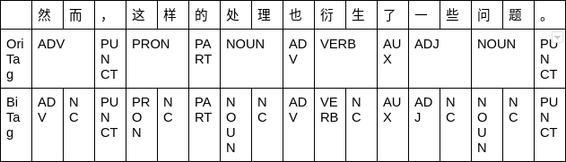
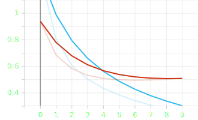

# Chinese Part-of-Speech tagging with bi-LSTM attention network

**Full name**: Trang Nguyen

**Group**: BS-18-DS-01

**Repo**: [https://github.com/tracy2811/chinese-pos-tagging-bi-lstm](https://github.com/tracy2811/chinese-pos-tagging-bi-lstm)

**Dataset**: [https://github.com/UniversalDependencies/UD_Chinese-GSDSimp/tree/master](https://github.com/UniversalDependencies/UD_Chinese-GSDSimp/tree/master)

**Notebook**: [notebook.ipynb](https://github.com/tracy2811/chinese-pos-tagging-bi-lstm/notebook.ipynb)

---

D1-4 is focusing on:

1. Build Joint Bi-LSTM model for WS and POS tagging

---

## Joint Bi-LSTM model

As pervious LSTM and Bi-LSTM model, this Bi-LSTM model also has 3 layers (Embedding, LSTM, Linear).

```
BiLSTMTagger(
  (word_embeddings): Embedding(3514, 64)
  (lstm): LSTM(64, 64, bidirectional=True)
  (hidden2tag): Linear(in_features=128, out_features=16, bias=True)
)
```

The only difference is how data is preprocessed and passed through model. Before mapping tokens to indexes, and POS tags to indexes, extra step is introduced with a new POS tag `NC` to indicate that this character follows with previous one. While previously, one token may contains many characters, now one token contains only one characters. See the example below.



## Train and Test Result

- Loss: negative log likelihood loss `NLLLoss`

- Optimizer: stochastic gradient descent `SGD`

- Metric: F1 score

- Number of epochs: 10

| Model         | F1 avg | F1     |
| ------------- | ------ | ------ |
| Joint Bi-LSTM | 0.8461 | 0.8471 |

Joint Bi-LSTM train and test loss


## Random result

```
由于认为德义军队战力已就绪，隆美尔决定再发动攻势。
['ADP', 'NC', 'VERB', 'NC', 'PROPN', 'PROPN', 'NOUN', 'NC', 'NOUN', 'NC', 'ADV', 'VERB', 'NC', 'PUNCT', 'PROPN', 'NC', 'NC', 'VERB', 'NC', 'ADV', 'VERB', 'NC', 'NOUN', 'NC', 'PUNCT']
['ADP', 'NC', 'VERB', 'NC', 'PROPN', 'NC', 'NOUN', 'NC', 'NOUN', 'NC', 'ADV', 'VERB', 'NC', 'PUNCT', 'PROPN', 'NC', 'NC', 'NOUN', 'NC', 'ADV', 'VERB', 'NC', 'NOUN', 'NC', 'PUNCT']
0.916952380952381
```

## References

- [https://www.kaggle.com/krishanudb/lstm-character-word-pos-tag-model-pytorch](https://www.kaggle.com/krishanudb/lstm-character-word-pos-tag-model-pytorch)
