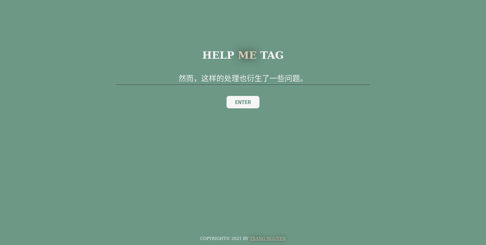
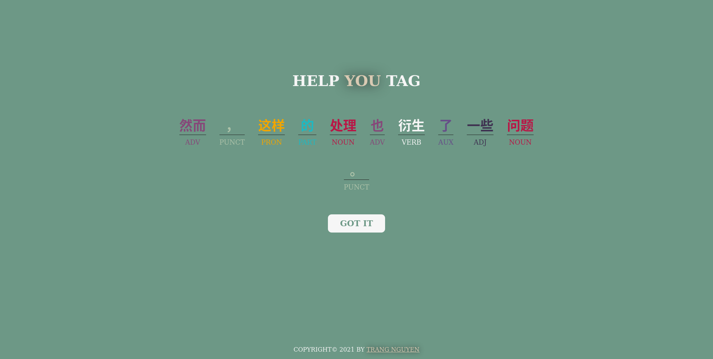

# Chinese Part-of-Speech tagging with bi-LSTM attention network

**Full name**: Trang Nguyen

**Group**: BS-18-DS-01

**Repo**: [https://github.com/tracy2811/chinese-pos-tagging-bi-lstm](https://github.com/tracy2811/chinese-pos-tagging-bi-lstm)

**Dataset**: [https://github.com/UniversalDependencies/UD_Chinese-GSDSimp/tree/master](https://github.com/UniversalDependencies/UD_Chinese-GSDSimp/tree/master)

**Notebook**: [notebook.ipynb](https://github.com/tracy2811/chinese-pos-tagging-bi-lstm/notebook.ipynb)

------------------------

D1-5 is focusing on:

1. Built a Web demo for Joint Bi-LSTM

-------------------------


After training, the joint model is deployed to web using Flask. The web app allows user to input a Simplified Chinese sentence, then displays the segmented result with POS tags.

Setup:

  1. Make sure Python 3 is installed. Download this repo, then go inside demo folder.

  1. Install packages and start server

      ```
      pip install -r requirements.txt
      flask run
      ```

  1. Go to [localhost:5000](localhost:5000)


Following are its screenshots.

Input screenshot


Result screenshot

