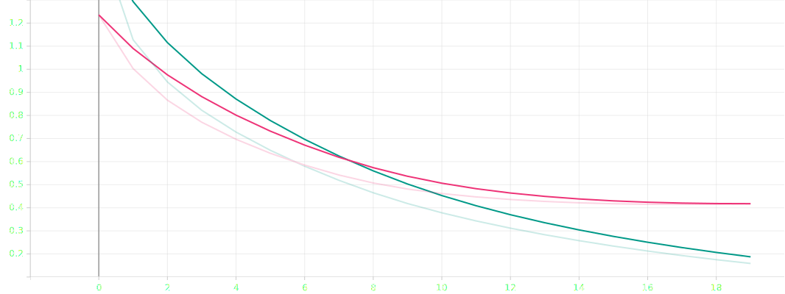

# Chinese Part-of-Speech tagging with bi-LSTM network

**Name**: Trang Nguyen

**Group**: BS-18-DS-01

**Repo**: [https://github.com/tracy2811/chinese-pos-tagging-bi-lstm](https://github.com/tracy2811/chinese-pos-tagging-bi-lstm)

---

This project aims for doing Part-of-Speech (POS) tagging for Simplified Chinese using Pytorch. Two simple models, i.e. LTSM, and Bi-LSTM have been trained using [UD_Chinese-GSDSimp](https://github.com/UniversalDependencies/UD_Chinese-GSDSimp/tree/master) dataset. F1 score has been used to evaluate results. Latter, the Bi-LSTM model with better performance has been chosen to do two tasks, i.e. word segmentation (WS) and POS tagging. This joint Bi-LSTM model then has been deployed to web, which allows user to input a Chinese sentence, then display segmented with POS tags result.

---

## Dataset

This project use [UD_Chinese-GSDSimp](https://github.com/UniversalDependencies/UD_Chinese-GSDSimp/tree/master) dataset from [Universal Dependencies](https://universaldependencies.org) which is free, consistent. It contains 4997 segmented sentences (3997 training sentences, 500 testing sentences) and uses 15 UPOS tags (out of 17 possible).

15 out of 17 Universal POS tags
POS tag | Meaning | Class
--- | --- | ---
ADJ | Adjective | Open
ADV | Adverb | Open
NOUN | Noun | Open
PROPN | Pronoun | Open
VERB | Verb | Open
ADP | Adposition | Closed
AUX | Auxiliary | Closed
CCONJ | Coordinating conjunction | Closed
DET | Determiner | Closed
NUM | Numeral | Closed
PART | Particle | Closed
PRON | Pronoun | Closed
PUNCT | Punctuation | Other
SYM | Symbol | Other
X | Other | Other

Example data:

```
# sent_id = test-s1
# text = 然而，这样的处理也衍生了一些问题。
1	然而	然而	ADV	RB	_	7	mark	_	SpaceAfter=No
2	，	，	PUNCT	,	_	7	punct	_	SpaceAfter=No
3	这样	这样	PRON	PRD	_	5	det	_	SpaceAfter=No
4	的	的	PART	DEC	Case=Gen	3	case	_	SpaceAfter=No
5	处理	处理	NOUN	NN	_	7	nsubj	_	SpaceAfter=No
6	也	也	ADV	RB	_	7	mark	_	SpaceAfter=No
7	衍生	衍生	VERB	VV	_	0	root	_	SpaceAfter=No
8	了	了	AUX	AS	Aspect=Perf	7	aux	_	SpaceAfter=No
9	一些	一些	ADJ	JJ	_	10	amod	_	SpaceAfter=No
10	问题	问题	NOUN	NN	_	7	obj	_	SpaceAfter=No
11	。	。	PUNCT	.	_	7	punct	_	SpaceAfter=No
```

Dataset link: [https://github.com/UniversalDependencies/UD_Chinese-GSDSimp/tree/master](https://github.com/UniversalDependencies/UD_Chinese-GSDSimp/tree/master)

---

## Pre-processing

Each token in each sentence is convert to a number (index). The same happens with each POS tag. The only difference between data passing through the POS-tagging-only models (LSTM, and Bi-LSTM) and the joint Bi-LSTM is how those tokens and POS tags have been defined.

### For POS-tagging-only models (LSTM, and Bi-LSTM)

There are no extra steps before mapping between tokens/tags and their indexes, no new tag is introduced. Each token may have one ore more Simplified characters.

### For Joint WS and POS tagging model (Joint Bi-LSTM)

One token is one character. New tag `NC` is introduced to indicate that this character joins with the previous character. 15 original POS tags are point at the first character of the original segments.


Example sentence: `然而，这样的处理也衍生了一些问题。`

Original segmentation: `然而/，/这样/的/处理/也/衍生/了/一些/问题/。`

Original POS tags: `ADV/PUNCT/PRON/PART/NOUN/ADV/VERB/AUX/ADJ/NOUN/PUNCT`

Joint segmentation: `然/而/，/这/样/的/处/理/也/衍/生/了/一/些/问/题/。`

Joint POS tags: `ADV/NC/PUNCT/PRON/NC/PART/NOUN/NC/ADV/VERB/NC/AUX/ADJ/NC/NOUN/NC/PUNCT`

---

## Models

Both three simple models have same structure: one Embedding layer following by LSTM layer and Linear layer for classification. The only difference is inside the LSTM layer, whether it is bidirectional or not. Following shows summary for the Bi-LSTM model. The Embedding dimension `EMBEDDING_DIM` and hidden dimension `HIDDEN_DIM` are set to 64.

```
BiLSTMTagger(
  (word_embeddings): Embedding(3514, 64)
  (lstm): LSTM(64, 64, bidirectional=True)
  (hidden2tag): Linear(in_features=128, out_features=16, bias=True)
)
```

---

## Train and Test Results

To train models, the negative log likelihood loss `NLLLoss` and stochastic gradient descent optimizer `SGD` are used. Each model is trained through 10 epochs. To evaluate results, F1 score, including the average of F1 for each sentence, and F1 for whole data, is used. For tagging-only models, the Bi-LSTM has slightly better performance.

| Model         | F1 avg | F1     |
| ------------- | ------ | ------ |
| LSTM          | 0.7933 | 0.7930 |
| Bi-LSTM       | 0.8185 | 0.8140 |
| Joint Bi-LSTM | 0.8461 | 0.8471 |

LSTM train and test loss


Bi-LSTM train and test loss


Joint Bi-LSTM train and test loss


Joint Bi-LSTM prediction example:

```
由于认为德义军队战力已就绪，隆美尔决定再发动攻势。
['ADP', 'NC', 'VERB', 'NC', 'PROPN', 'PROPN', 'NOUN', 'NC', 'NOUN', 'NC', 'ADV', 'VERB', 'NC', 'PUNCT', 'PROPN', 'NC', 'NC', 'VERB', 'NC', 'ADV', 'VERB', 'NC', 'NOUN', 'NC', 'PUNCT']
['ADP', 'NC', 'VERB', 'NC', 'PROPN', 'NC', 'NOUN', 'NC', 'NOUN', 'NC', 'ADV', 'VERB', 'NC', 'PUNCT', 'PROPN', 'NC', 'NC', 'NOUN', 'NC', 'ADV', 'VERB', 'NC', 'NOUN', 'NC', 'PUNCT']
0.916952380952381
```
Latter 3 hyperparameters, i.e. embedding dimension, hidden dimension, and learning rate are tuned for Joint Bi-LSTM model. Their best values are `256`, `256`, and `0.0145183` respectively. After 20 epochs with these values, the Joint Bi-LSTM has F1 score of `0.8698`, better than before.

Joint Bi-LSTM (with tuned hyperparameters) train and test loss


---

## Web Demo

After training, the joint model is deployed to web using Flask. The web app allows user to input a Simplified Chinese sentence, then displays the segmented result with POS tags. Following are its screenshots.

Input screenshot


Result screenshot


---

## Discussion and Future Work

There are many models which give excellent segmentation and tagging results. However, for this simple model, F1 score of 0.8471 is not bad. Attention and more layers can be added to obtain better results. Other metrics may be considered to evaluate word segmentation performance instead of F1 score. The web app itself can plug in other features to become a useful feature-rich learning language tool. For example, some Chinese dictionaries, such as [CC-CEDICT](https://www.mdbg.net/chinese/dictionary?page=cedict) can be added to show definition of each token from result.

---

## References

- [Kaggle note book: LSTM (character + word) POS-tag model PyTorch ](https://www.kaggle.com/krishanudb/lstm-character-word-pos-tag-model-pytorch)
- [Joint Khmer Word Segmentation and POS Tagging](https://towardsdatascience.com/joint-khmer-word-segmentation-and-pos-tagging-cad650e78d30)
- [Hyperparameter tuning with Ray Tune](https://pytorch.org/tutorials/beginner/hyperparameter_tuning_tutorial.html)
